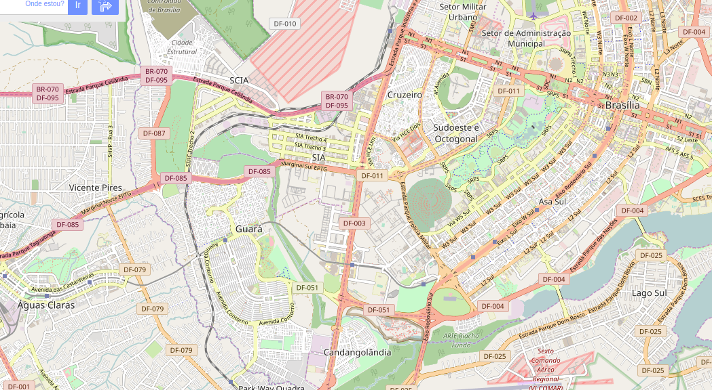

# Problemas Encontrados no Mapa
A primeira vista observei que existiam:

+ Códigos postais em diferentes formatações: 71733-105, 7289255, 71.727-127.
+ Endereços errados ou inconsistentes como `{city:GuaraII}`, `{suburb:GuaraII, city:Brasilia}`.
+ Atributo “place” quando deveria estar como “city”.


## Códigos Postais
Durante algumas rápidas checagens foram encontradas má formatação, é importante
que os dados sigam o mesmo padrão de apresentação para um mesmo campo, porém os
ceps (codigos postais) estão despadronizados, com o python cada elemento de cep
teve a formatação removida e repadronizado para o formato mais usual
(XX.XXX-XXX), por fim reinserida com um update.

Primeiro utilizei o código `process.py` para converter o arquivo xml para um
formato json e então inserir os dados processados no mongo. Em seguida utilizei
o `reformat.py` para reformatar os ceps dos documentos.

```{#reformat .python3 .numberLines startFrom="13"}
for x in db.mapbsb.find():
	if 'postcode' in x:
		newcep = cepformat (x['postcode'])
			db.mapbsb.update_one({'_id ’: x['_id']},
								 {'$set': {'postcode': newcep}}))
```


## Endereços
Endereços estavam em variáveis incorretas, cidades como subúrbios, bairros e
regiões administrativas sem posição certa, parte disso se deve a natureza da
própria região, que segue uma lógica diferente do resto do Brasil para
delimitação de territórios, também estavam em categorias completamente fora de
sentido como uma cidade com atributo place. Uma parte significativa dessas
correções tiveram de ser manuais.

# Visão Geral do Dados

|Tamanho |	Arquivo |
|-------:+:---------|
|    76M | docs.json|
|    83M | map.osm  |

Table: Descrição dos dados.

## Número de Documentos
```
mongo> db.mapbsb.find().count()
427542
```

## Número de Tags por Tag
```
mongo> db.mapbsb.find({type:'node'}).count()
349393
mongo> db.mapbsb.find({type:'way'}).count()
77346
mongo> db.mapbsb.find({type:'relation'}).count()
0
mongo> db.mapbsb.find({type:'area'}).count()
0
```
No mapa não tivemos nem uma relação ou area.

## Número de Usuários Únicos
```
> db.mapbsb.distinct('created.user').length
538
```
538 usuários diferentes contribuiram para na edição do mapa.

## Maiores Contribuidores
```
mongo> db.mapbsb.aggregate([{"$group":{"_id":"$created.user", "count":{"$sum":1}}},
							{"$sort":{"count": −1}},{"$limit":5}])
{ "_id" : " erickdeoliveiraleal ", "count" : 105393 }
{ "_id" : " MAPconcierge ", "count" : 38126 }
{ "_id" : " teste18 ", "count" : 27945 }
{ "_id" : " Linhares ", "count" : 24825 }
{ "_id" : "wille", "count" : 17899 }
```
O usuário `erickdeoliveiraleal` tem cerca de 30% das contribuições para o mapa.
Muito a frente de outros usuários.

## Contribuição por Mês/Ano
```
mongo> db.mapbsb.aggregate(
    {$project: {
        month: {$month: "$timestamp"},
         year: {$year:  "$timestamp"}}},
    {$group: {
        _id: {month: "$month", year: "$year"},
      total: {$sum: 1}}})
{ "_id" : { "month" : 12, "year" : 2008 }, "total" : 1 }
{ "_id" : { "month" : 8, "year" : 2012 }, "total" : 12 }
{ "_id" : { "month" : 5, "year" : 2012 }, "total" : 1824 }
{ "_id" : { "month" : 11, "year" : 2012 }, "total" : 12696 }
{ "_id" : { "month" : 10, "year" : 2011 }, "total" : 4222 }
{ "_id" : { "month" : 11, "year" : 2008 }, "total" : 13 }
{ "_id" : { "month" : 9, "year" : 2012 }, "total" : 1283 }
{ "_id" : { "month" : 12, "year" : 2016 }, "total" : 6288 }
{ "_id" : { "month" : 11, "year" : 2015 }, "total" : 10258 }
{ "_id" : { "month" : 7, "year" : 2011 }, "total" : 603 }
{ "_id" : { "month" : 10, "year" : 2008 }, "total" : 182 }
{ "_id" : { "month" : 11, "year" : 2013 }, "total" : 6682 }
{ "_id" : { "month" : 1, "year" : 2013 }, "total" : 1470 }
{ "_id" : { "month" : 6, "year" : 2015 }, "total" : 4408 }
{ "_id" : { "month" : 1, "year" : 2016 }, "total" : 2757 }
{ "_id" : { "month" : 2, "year" : 2011 }, "total" : 1891 }
{ "_id" : { "month" : 1, "year" : 2011 }, "total" : 2960 }
{ "_id" : { "month" : 7, "year" : 2016 }, "total" : 4146 }
{ "_id" : { "month" : 8, "year" : 2014 }, "total" : 6644 }
{ "_id" : { "month" : 11, "year" : 2014 }, "total" : 6682 }
```
Temos contribuições indo do ano 2008 até 2016, sendo o periodo com maior numero
de contribuições novembro de 2012.

# Ideias Adicionais
Como já citado, as tags não estão muito bem padronizadas quanto a classificações
, é necessário que se crie uma norma de classificação para os endereços do
Brasil e especificamento do Distrito Federal que foje um pouco do padrão
nacional. É possivel ainda fazer diversas melhorias através de dicionários e
funções ad-hoc para uma maior normalização/padronização dos dados.

Também há muito informação desnecessária, descrições muito detalhadas no campo
descrição, redundância de informação e etc. Fazendo com que  os dados terem
ocupem muito mais espaço de armazenamento.

Podemos ver também que apenas um percentual pequeno da população contribui com
os dados, de tal forma que regiões mais novas ou mais pobres são pouco mapeadas,
se houvesse uma gamificação quanto a contribuição, talvez mais usuários
contribuiriam.



# Referências
https://docs.google.com/document/d/1F0Vs14oNEs2idFJR3C_OPxwS6L0HPliOii-QpbmrMo4/pub

https://wiki.openstreetmap.org/wiki/Main_Page
